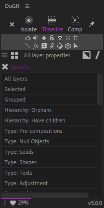
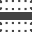
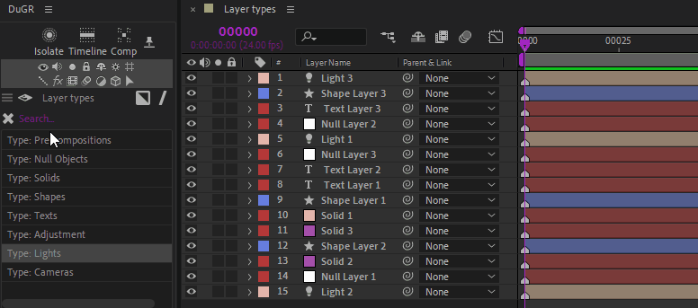
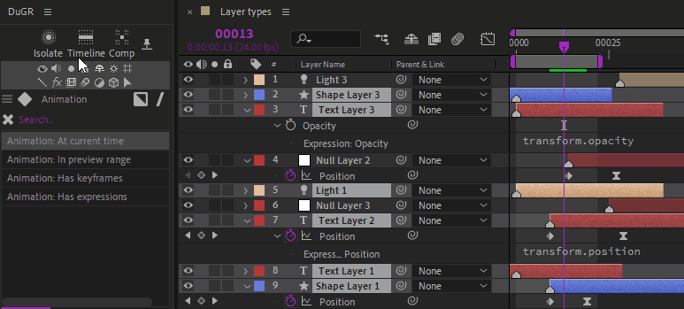
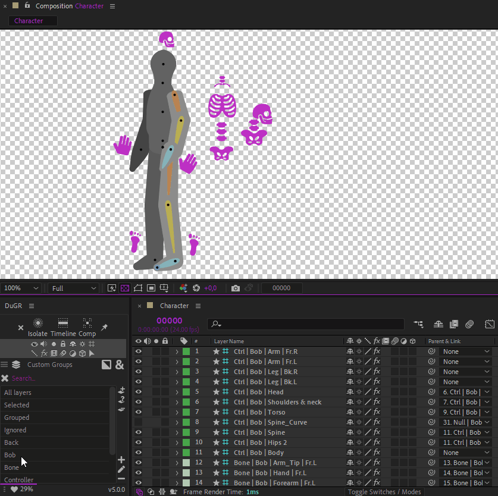

# DuGR Help

Dugr lets you to tag the layers so they belong to groups. Those groups are listed in the panel, and it is easy to isolate them in the composition, change their attributes, etc.

## Group lists

With the selector just above the list, you can select what is shown in the list.

- {: style="width:20px;"} ***Properties*** allows you to select the layers by type, property or hierarchy or other After Effects attributes.

- {: style="width:20px;"} ***Groups*** contains the list of tags/custom groups you've added.

You can select the group of layers you need to manipulate from this list.

The {: style="width:20px;"} ***Invert*** button on the right-hand side can be used to manipulate layers **not** contained in the selected groups.

The {: style="width:20px;"} ***And*** {: style="width:20px;"} ***Or*** button on the right-hand side is used to choose how multiple group selection is made, either using **all** groups (*and*) or **any** group (*or*).

## Isolation

The top line buttons are toggles to isolate the layers belonging to the selected groups.

- {: style="width:20px;"} ***Isolate*** isolates the layer both in the timeline and the comp viewer panel. Layers outside of selected groups are both hidden and set to shy mode.
- {: style="width:20px;"} ***Timeline*** isolates the layer only in the timeline. Layers outside of selected groups are set to shy mode.
- {: style="width:20px;"} ***Comp*** isolates the layer only in the comp viewer panel. Layers outside of selected groups are hidden.
- {: style="width:20px;"} The *pin* button toggles the ***Interactive*** or ***Sticky*** mode. When checked, the isolation is updated as soon as you change the group selection. When disabled, you have to manually change the isolation mode after changing group selection. With heavy compositions containing a lot of layers, keeping it disabled improves the performance.
- {: style="width:20px;"} The *exit isolation* button can be used to de-activate the isolation when *not* in *interactive / sticky* mode.

!!! note
    You can assign keyboard shortcuts to these functions, using the provided [*Scriptlets*](install.md#keyboard-shortcuts)!

  
*Auto-Select / Filter by layer type, property, attribute...*

  
*Auto-Select / Filter by animation properties...*

A lot of other properties and attributes are available to select and isolate specific layers.

  
*DuGR is fully compatible with Duik Ángela, which automatically assigns layers to useful DuGR custom groups.*

  
*You can also assign [keyboard shortcuts](install.md#keyboard-shortcuts) to DuGR features.*

### Interactive / Sticky mode

There are two ways to use *DuGR* to isolate layers:

- In standard mode, when the {: style="width:12px;"} *pin* button is unchecked, clicking on the {: style="width:12px;"}{: style="width:12px;"}{: style="width:12px;"} isolation buttons isolates the selected groups; but nothing will change if you change the group selection, unless you click again on the isolation buttons. To exit the isolation mode, either select the "*All layers*" group, or click the {: style="width:12px;"} *exit* button.
- In interactive / sticky mode, when the {: style="width:12px;"} *pin* button is checked, changing the selection of the groups instantly updates the isolation. Click again on the {: style="width:12px;"}{: style="width:12px;"}{: style="width:12px;"} isolation buttons to exist the isolation mode.

## Layer properties

The two middle lines of small icons can be used to quickly change the usual properties of the layers contained in the selected groups.

The extra {: style="width:12px;"} *arrow* icon selects the layers contained in the selected groups.

## Managing custom groups

!

On the ***custom groups tab***, a few extra buttons allow you to create, edit and remove groups.

### Layer buttons

- {: style="width:20px;"} ***Add selected layer*** to the current groups.
- {: style="width:20px;"} ***Select groups*** the current layers belong to.
- {: style="width:20px;"} ***Remove selected layers*** from the current group.

### Group buttons

- {: style="width:20px;"} ***Create group***.
- {: style="width:20px;"} ***Rename group***.
- {: style="width:20px;"} ***Remove group***.

### Bottom line icons

At the bottom line of the panel, a few icons are always there if you need them.

- {: style="width:20px;"} Post a ***Bug Report*** if something goes wrong.
- {: style="width:20px;"} Post a ***Feature Request*** if you have a good idea to share.
- {: style="width:20px;"} Go to the ***Settings panel*** to customize the script.
- {: style="width:20px;"} Come here if you need ***Help***.
- {: style="width:20px;"} Click this ***if you like*** *DuGR*!.