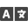
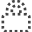

# {: style="width:32px;"} DuGR Settings

You can access the settings panel with the {: style="width:20px;"} wrench icon on the bottom line of the panel.

## Common settings

The upper part of the panel contains common settings which are the same across all *Duduf/RxLab* scripts.

- Use the {: style="width:20px;"} ***Language*** button to change the language of the script.
- Use the {: style="width:20px;"} ***Settings file*** button to change the location where are stored these settings. You can use the settings file to easily move the settings to another workstation, or to sync it using an app like [*Syncthing*](https://syncthing.net/).
- The ***Color menu*** allows you to change the highlight color of the script.
- The ***UI Mode*** menu allows you to choose between three modes:
    - {: style="width:20px;"} ***Rookie*** is a mode where there are more texts, which makes the script easier to understand and to use to get started quickly, but the user interface takes more room.
    - {: style="width:20px;"} ***Standard*** is the recommended mode if you already know how to use the script. Some texts are hidden and replaced by icons, which makes the UI smaller and less intrusive.
    - {: style="width:20px;"} ***Expert*** is the mode you can use if you prefer a very small UI, wihout any text and just icons.
- The {: style="width:20px;"} ***Normal mode*** and {: style="width:20px;"} ***Dev & Debug mode*** switch should always stay on *Normal mode* unless: you've found a bug, and in this case errors shown by the *Debug mode* can help us tackle it down, or you're working on the development of the script and you need some debug information.

## DuGR settings

The second part of the panel contains *DuGR* specific settings.

-  You can hide the After Effects layer switches if you don't need them and need more room. These switches are these buttons on the top of the panel:  
  
- {: style="width:20px;"} You can choose to ***allow*** or ***deny changes*** to locked layers.
- *DuGR* creates a semi-transparent red frame around the composition to let you know your in isolation mode. You can choose its placement:
    - {: style="width:20px;"} ***No Frame*** at all.
    - {: style="width:20px;"} ***Frame Above*** all layers.
    - {: style="width:20px;"} ***Frame Below*** all layers.
- You can choose how layers must be hidden:
    - {: style="width:20px;"} ***Wireframe*** will replace layers by a bounding box and a cross.
    - {: style="width:20px;"} Or you can just ***hide*** them.
- You can hide or show the markers (tags) from the layer:
    - {: style="width:20px;"} ***Show tags***.
    - {: style="width:20px;"} ***Hide tags***.
- {: style="width:20px;"} You can automatically select the layers in After Effects when you select a group in DuGR.
- {: style="width:20px;"} You can choose to either automatically lock the layers which are hidden, or leave them as they are.

## Other

- The {: style="width:20px;"} ***Check for updates*** button will check online if a new version of *DuGR* is available for you to download.